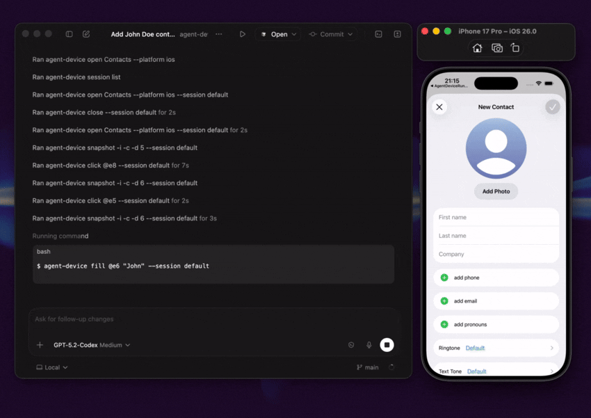

<a href="https://www.callstack.com/open-source?utm_campaign=generic&utm_source=github&utm_medium=referral&utm_content=agent-device" align="center">
  <picture>
    
  </picture>
</a>

---

# agent-device

[](https://www.npmjs.com/package/agent-device)
[](https://github.com/callstackincubator/agent-device/actions/workflows/ci.yml)
[](LICENSE)

Device automation CLI for AI agents. Mobile, TV, and desktop apps.

`agent-device` lets coding agents run real apps, inspect UI state, interact with visible elements, and collect debugging evidence from the terminal.

It is built around token-efficient accessibility snapshots, not pixel-first screenshots. Agents read compact UI trees, locate elements through refs like `@e3`, perform touch and text actions, and capture screenshots, video, logs, network, perf, and React profiles only when evidence is needed.

Built for two agentic workflows:

- **Quality Assurance**: dogfood flows, validate PR builds, check accessibility coverage, capture evidence, and turn stable explorations into `.ad` e2e tests.
- **Development**: build from specs, reproduce crashes and support issues, inspect logs/network/perf data, and iterate until the UI matches the work.

If you know Vercel's [agent-browser](https://github.com/vercel-labs/agent-browser), this is the same idea for apps and devices.



## Quick Start

Install the CLI.

```bash
npm install -g agent-device
```

Prerequisites: Node.js 22+, Xcode for iOS/tvOS/macOS targets, Android SDK + ADB for Android, and macOS permissions for desktop automation. See [Installation](https://incubator.callstack.com/agent-device/docs/installation).

Try the loop.

```bash
# Find the app.
agent-device apps --platform ios

# Start a session.
agent-device open SampleApp --platform ios

# Inspect the current screen.
agent-device snapshot -i
# @e1 [heading] "Settings"
# @e2 [button] "Sign In"
# @e3 [text-field] "Email"

# Act, capture a screenshot, and close.
agent-device fill @e3 "test"
agent-device screenshot ./artifacts/settings.png
agent-device close
```

Refs from the default snapshot are immediately actionable. For hidden content, scroll and re-snapshot.

Choose how to run it.

| Path | Best for | Start with |
| --- | --- | --- |
| Local | Simulators, emulators, physical devices, macOS apps, and Linux desktop targets. | Bring your own devices and wire `agent-device` into your agent workflow. |
| CI/CD | Smoke checks, replay suites, QA flows, debugging, and PR validation. | Start with the [EAS workflow template](https://github.com/callstackincubator/eas-agent-device/blob/main/.eas/workflows/agent-qa-mobile.yml). GitHub Actions template coming soon. |
| Cloud | Linux runners, managed devices, and remote execution. | Use [Agent Device Cloud](https://agent-device.dev/cloud) or [contact Callstack](mailto:hello@callstack.com) for team-scale QA. |

## How It Works

`agent-device` runs session-aware commands through platform backends: XCTest for iOS and tvOS, ADB plus the Android snapshot helper for Android, a local helper for macOS desktop automation, and AT-SPI for Linux desktop targets. See [Introduction](https://incubator.callstack.com/agent-device/docs/introduction) and [Commands](https://incubator.callstack.com/agent-device/docs/commands) for platform details.

## Capabilities

- **Platforms**: iOS, Android, tvOS, Android TV, macOS, and Linux. Real devices and simulators are supported.
- **Capture**: screenshots, video, logs, network traffic, performance data, accessibility snapshots, and React render profiles.
- **Produce**: replayable `.ad` scripts, e2e test runs, diff output, and debugging artifacts.
- **React Native and Expo**: component tree inspection, props/state/hooks, and render profiling.
- **License**: MIT. Free to use.

## Used By

Used by teams and developers at Callstack, Expensify, [Shopify](https://x.com/mustafa01ali/status/2035155157982289998), [Kindred](https://x.com/sregg/status/2045231628369191075), Total Wine & More, [LegendList](https://x.com/jmeistrich/status/2036398735698305178), [HerLyfe](https://x.com/oliverbowman_), App & Flow, and more.

- [Oliver Bowman](https://x.com/oliverbowman_), HerLyfe: reduced the feedback loop in agentic workflows.
- [Jay Meistrich](https://x.com/jmeistrich/status/2036398735698305178), LegendList: used it for Android phone and iOS simulator testing while developing LegendList optimizations.

## Documentation

- [Installation](https://incubator.callstack.com/agent-device/docs/installation)
- [Commands](https://incubator.callstack.com/agent-device/docs/commands)
- [Replay & E2E](https://incubator.callstack.com/agent-device/docs/replay-e2e)
- [Known limitations](https://incubator.callstack.com/agent-device/docs/known-limitations)

Agent integration:

- [agent-device skill](skills/agent-device/SKILL.md)
- [react-devtools skill](skills/react-devtools/SKILL.md)
- [dogfood skill](skills/dogfood/SKILL.md)
- [agent-device skill on ClawHub](https://clawhub.ai/okwasniewski/agent-device)

## Contributing

See [CONTRIBUTING.md](CONTRIBUTING.md).

## Made at Callstack

agent-device is an open source project and will always remain free to use. Callstack is a group of React and React Native geeks. Contact us at hello@callstack.com if you need any help with these technologies or just want to say hi.
