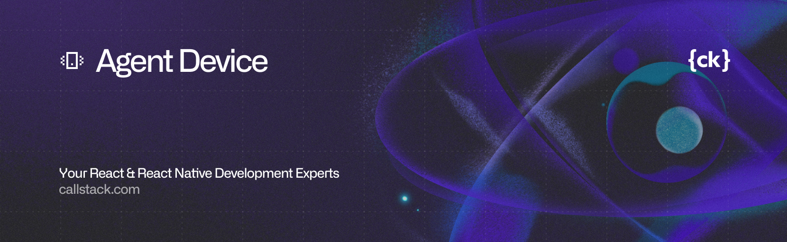

<a href="https://www.callstack.com/open-source?utm_campaign=generic&utm_source=github&utm_medium=referral&utm_content=agent-device" align="center">
  <picture>
    
  </picture>
</a>

---

# agent-device

`agent-device` is a CLI for mobile UI automation on iOS, tvOS, Android, and AndroidTV. It is designed for agent-driven workflows: inspect the UI, act on it deterministically, and keep that work session-aware and replayable.

If you know Vercel's [agent-browser](https://github.com/vercel-labs/agent-browser), this project applies the same broad idea to mobile apps and devices.

<video src="https://github.com/user-attachments/assets/db81d164-c179-4e68-97fa-53f06e467211" controls muted playsinline></video>

## Project Goals

- Give agents a practical way to understand mobile UI state through structured snapshots.
- Keep automation flows token-efficient enough for real agent loops.
- Make common interactions reliable enough for repeated automation runs.
- Keep automation grounded in sessions, selectors, and replayable flows instead of one-off scripts.

## Core Ideas

- Sessions: open a target once, interact within that session, then close it cleanly.
- Snapshots: inspect the current accessibility tree in a compact form and get stable refs for exploration.
- Refs vs selectors: use refs for discovery, use selectors for durable replay and assertions.
- Human docs vs agent skills: docs explain the system for people; skills provide compact operating guidance for agents.

## Command Flow

The canonical loop is:

```bash
agent-device open Settings --platform ios
agent-device snapshot -i
agent-device press @e3
agent-device diff snapshot -i
agent-device fill @e5 "test"
agent-device close
```

In practice, most work follows the same pattern:

1. `open` a target app or URL.
2. `snapshot -i` to inspect the current screen.
3. `press`, `fill`, `scroll`, `get`, or `wait` using refs or selectors.
4. `diff snapshot` or re-snapshot after UI changes.
5. `close` when the session is finished.

## Where To Go Next

For people:

- [Introduction](website/docs/docs/introduction.md)
- [Quick Start](website/docs/docs/quick-start.md)
- [Commands](website/docs/docs/commands.md)
- [Snapshots](website/docs/docs/snapshots.md)
- [Selectors](website/docs/docs/selectors.md)
- [Sessions](website/docs/docs/sessions.md)
- [Configuration](website/docs/docs/configuration.md)
- [Client API](website/docs/docs/client-api.md)

For agents:

- [agent-device skill](skills/agent-device/SKILL.md)
- [Dogfood exploratory QA skill](skills/dogfood/SKILL.md)

## Install

```bash
npm install -g agent-device
```

Or use it without installing:

```bash
npx agent-device open SampleApp
```

For the typed daemon client and `installFromSource` behavior, see [website/docs/docs/client-api.md](website/docs/docs/client-api.md).

The skill is also accessible on [ClawHub](https://clawhub.ai/okwasniewski/agent-device).
For structured exploratory QA workflows, use the dogfood skill at [skills/dogfood/SKILL.md](skills/dogfood/SKILL.md).

## Quick Start

Use refs for agent-driven exploration and normal automation flows.
Use `press` as the canonical tap command; `click` is an equivalent alias.

```bash
agent-device open Contacts --platform ios # creates session on iOS Simulator
agent-device snapshot
agent-device press @e5
agent-device diff snapshot # subsequent runs compare against previous baseline
agent-device fill @e6 "John"
agent-device fill @e7 "Doe"
agent-device press @e3
agent-device close
```

## Fast batching (JSON steps)

Use `batch` to execute multiple commands in a single daemon request.

CLI examples:

```bash
agent-device batch \
  --session sim \
  --platform ios \
  --udid 00008150-001849640CF8401C \
  --steps-file /tmp/batch-steps.json \
  --json
```

Small inline payloads are also supported:

```bash
agent-device batch --steps '[{"command":"open","positionals":["settings"]},{"command":"wait","positionals":["100"]}]'
```

Batch payload format:

```json
[
  { "command": "open", "positionals": ["settings"], "flags": {} },
  { "command": "wait", "positionals": ["label=\"Privacy & Security\"", "3000"], "flags": {} },
  { "command": "click", "positionals": ["label=\"Privacy & Security\""], "flags": {} },
  { "command": "get", "positionals": ["text", "label=\"Tracking\""], "flags": {} }
]
```

Batch response includes:

- `total`, `executed`, `totalDurationMs`
- per-step `results[]` with `durationMs`
- failure context with failing `step` and `partialResults`

Agent usage guidelines:

- Keep each batch to one screen-local workflow.
- Add sync guards (`wait`, `is exists`) after mutating steps (`open`, `click`, `fill`, `swipe`).
- Treat refs/snapshot assumptions as stale after UI mutations.
- Prefer `--steps-file` over inline JSON for reliability.
- Keep batches moderate (about 5-20 steps) and stop on first error.

## CLI Usage

```bash
agent-device <command> [args] [--json]
```

## Configuration

Create an `agent-device.json` file to set persistent CLI defaults instead of repeating flags.

Config file lookup order:
- `~/.agent-device/config.json`
- `./agent-device.json`
- `AGENT_DEVICE_*` environment variables
- CLI flags

Later sources override earlier ones. Use `--config <path>` or `AGENT_DEVICE_CONFIG` to load one explicit config file instead of the default locations.

Example:

```json
{
  "platform": "ios",
  "device": "iPhone 16",
  "session": "qa-ios",
  "snapshotDepth": 3,
  "daemonBaseUrl": "http://mac-host.example:4310/agent-device"
}
```

Notes:
- Config keys use the existing camelCase flag names, for example `stateDir`, `daemonAuthToken`, `iosSimulatorDeviceSet`, and `androidDeviceAllowlist`.
- Environment overrides use `AGENT_DEVICE_*` uppercase snake case names, for example `AGENT_DEVICE_SESSION`, `AGENT_DEVICE_DAEMON_BASE_URL`, and `AGENT_DEVICE_IOS_SIMULATOR_DEVICE_SET`.
- Bound-session routing defaults also work through config or env, for example `sessionLock` / `AGENT_DEVICE_SESSION_LOCK`.
- For options that have CLI aliases, config/env use the canonical value rather than the alias flag. Example: use `"appsFilter": "user-installed"` or `AGENT_DEVICE_APPS_FILTER=user-installed`, not `--user-installed`.
- Command-specific defaults are applied only when that command supports them, so a `snapshotDepth` default does not break `open` or `devices`.

Basic flow:

```bash
agent-device open SampleApp
agent-device snapshot
agent-device press @e7
agent-device fill @e8 "hello"
agent-device close SampleApp
```

Debug flow:

```bash
agent-device trace start
agent-device snapshot -s "Sample App"
agent-device find label "Wi-Fi" click
agent-device trace stop ./trace.log
```

Coordinates:
- All coordinate-based commands (`press`, `longpress`, `swipe`, `focus`, `fill`) use device coordinates with origin at top-left.
- X increases to the right, Y increases downward.
- `press` is the canonical tap command.
- `click` is an equivalent alias and accepts the same targets (`x y`, `@ref`, selector) and flags.

Gesture series examples:

```bash
agent-device press 300 500 --count 12 --interval-ms 45
agent-device press 300 500 --count 6 --hold-ms 120 --interval-ms 30 --jitter-px 2
agent-device press @e5 --count 5 --double-tap
agent-device swipe 540 1500 540 500 120 --count 8 --pause-ms 30 --pattern ping-pong
agent-device scrollintoview "Sign in"
agent-device scrollintoview @e42
```

## Command Index
- `boot`, `open`, `close`, `install`, `reinstall`, `home`, `back`, `app-switcher`
- `push`
- `batch`
- `snapshot`, `diff snapshot`, `find`, `get`
- `press` (alias: `click`), `focus`, `type`, `fill`, `long-press`, `swipe`, `scroll`, `scrollintoview`, `pinch`, `is`
- `alert`, `wait`, `screenshot`
- `trigger-app-event <event> [payloadJson]`
- `trace start`, `trace stop`
- `logs path`, `logs start`, `logs stop`, `logs clear`, `logs clear --restart`, `logs doctor`, `logs mark` (session app log file for grep; iOS simulator + iOS device + Android)
- `clipboard read`, `clipboard write <text>` (macOS + iOS simulator + Android)
- `keyboard [status|get|dismiss]` (Android emulator/device)
- `network dump [limit] [summary|headers|body|all]`, `network log ...` (best-effort HTTP(s) parsing from session app log)
- `settings wifi|airplane|location on|off`
- `settings appearance light|dark|toggle`
- `settings faceid match|nonmatch|enroll|unenroll` (iOS simulator only)
- `settings touchid match|nonmatch|enroll|unenroll` (iOS simulator only)
- `settings fingerprint match|nonmatch` (Android emulator/device where supported)
- `settings permission grant|deny|reset camera|microphone|photos|contacts|notifications [full|limited]`
- `appstate`, `apps`, `devices`, `session list`
- `perf` (alias: `metrics`)

Push notification simulation:

```bash
# iOS simulator: app bundle + payload file
agent-device push com.example.app ./payload.apns --platform ios --device "iPhone 16"

# iOS simulator: inline JSON payload
agent-device push com.example.app '{"aps":{"alert":"Welcome","badge":1}}' --platform ios

# Android: package + payload (action/extras map)
agent-device push com.example.app '{"action":"com.example.app.PUSH","extras":{"title":"Welcome","unread":3,"promo":true}}' --platform android
```

Payload notes:
- iOS uses `xcrun simctl push <device> <bundle> <payload>` and requires APNs-style JSON object (for example `{"aps":{"alert":"..."}}`).
- Android uses `adb shell am broadcast` with payload JSON shape:
  `{"action":"<intent-action>","receiver":"<optional component>","extras":{"key":"value","flag":true,"count":3}}`.
- Android extras support string/boolean/number values.
- `push` works with session context (uses session device) or explicit device selectors.

App event triggers (app hook):

```bash
agent-device trigger-app-event screenshot_taken '{"source":"qa"}'
```

- `trigger-app-event` dispatches an app event via deep link and requires an app-side test/debug hook.
- `trigger-app-event` requires either an active session or explicit device selectors (`--platform`, `--device`, `--udid`, `--serial`).
- On iOS physical devices, custom-scheme deep links require active app context (open the app in-session first).
- Configure one of:
  - `AGENT_DEVICE_APP_EVENT_URL_TEMPLATE`
  - `AGENT_DEVICE_IOS_APP_EVENT_URL_TEMPLATE`
  - `AGENT_DEVICE_ANDROID_APP_EVENT_URL_TEMPLATE`
- Template placeholders: `{event}`, `{payload}`, `{platform}`.
- Example template: `myapp://agent-device/event?name={event}&payload={payload}`.
- `payloadJson` must be a JSON object.
- This is app-hook-based simulation, not an OS-global notification injector.
- Canonical trigger contract lives in [`website/docs/docs/commands.md`](website/docs/docs/commands.md) under **App event triggers**.

## iOS Snapshots

Notes:
- iOS snapshots use XCTest on simulators and physical devices.
- Scope snapshots with `-s "<label>"` or `-s @ref`.
- If XCTest returns 0 nodes (e.g., foreground app changed), agent-device fails explicitly.
- `diff snapshot` uses the same snapshot flags and compares the current capture with the previous session baseline, then updates baseline.

Diff snapshots:
- Run `diff snapshot` once to initialize baseline for the current session.
- Run `diff snapshot` again after UI changes to get unified-style output (`-` removed, `+` added, unchanged context).
- Use `--json` to get `{ mode, baselineInitialized, summary, lines }`.

Efficient snapshot usage:
- Default to `snapshot -i` for iterative agent loops.
- Add `-s "<label>"` (or `-s @ref`) for screen-local work to reduce payload size.
- Add `-d <depth>` when lower tree levels are not needed.
- Re-snapshot after UI mutations before reusing refs.
- Use `diff snapshot` for low-noise structural change verification between adjacent states.
- Reserve `--raw` for troubleshooting and parser/debug investigations.

Flags:
- `--version, -V` print version and exit
- `--platform ios|macos|android|apple` (`apple` aliases the Apple automation backend)
- `--target mobile|tv|desktop` select device class within platform (requires `--platform`; for example AndroidTV/tvOS/macOS)
- `--device <name>`
- `--udid <udid>` (iOS)
- `--serial <serial>` (Android)
- `--ios-simulator-device-set <path>` constrain iOS simulator discovery/commands to one simulator set (`xcrun simctl --set`)
- `--android-device-allowlist <serials>` constrain Android discovery/selection to comma/space-separated serials
- `--activity <component>` (Android app launch only; package/Activity or package/.Activity; not for URL opens)
- `--session <name>`
- `--state-dir <path>` daemon state directory override (default: `~/.agent-device`)
- `--daemon-base-url <url>` explicit remote HTTP daemon base URL; skips local daemon discovery/startup
- `--daemon-auth-token <token>` remote HTTP daemon auth token; sent in both the JSON-RPC request token and HTTP auth headers (`Authorization: Bearer` and `x-agent-device-token`)
- `--daemon-transport auto|socket|http` daemon client transport preference
- `--daemon-server-mode socket|http|dual` daemon server mode (`http` and `dual` expose JSON-RPC over HTTP at `/rpc`)
- `--tenant <id>` tenant identifier used with session isolation
- `--session-isolation none|tenant` explicit session isolation mode (`tenant` scopes session namespace as `<tenant>:<session>`)
- `--run-id <id>` run identifier used with tenant-scoped lease admission
- `--lease-id <id>` active lease identifier used with tenant-scoped lease admission
- `--count <n>` repeat count for `press`/`swipe`
- `--interval-ms <ms>` delay between `press` iterations
- `--hold-ms <ms>` hold duration per `press` iteration
- `--jitter-px <n>` deterministic coordinate jitter for `press`
- `--double-tap` use a double-tap gesture per `press`/`click` iteration (cannot be combined with `--hold-ms` or `--jitter-px`)
- `--pause-ms <ms>` delay between `swipe` iterations
- `--pattern one-way|ping-pong` repeat pattern for `swipe`
- `--debug` (alias: `--verbose`) for debug diagnostics + daemon/runner logs
- `--json` for structured output
- `--steps <json>` batch: JSON array of steps
- `--steps-file <path>` batch: read step JSON from file
- `--on-error stop` batch: stop when a step fails
- `--max-steps <n>` batch: max allowed steps per request

Isolation precedence:
- Discovery scope (`--ios-simulator-device-set`, `--android-device-allowlist`) is applied before selector matching (`--device`, `--udid`, `--serial`).
- If a selector points outside the scoped set/allowlist, command resolution fails with `DEVICE_NOT_FOUND` (no host-global fallback).
- When `--ios-simulator-device-set` is set (or its env equivalent), iOS discovery is simulator-set only (physical iOS devices are not enumerated).

TV targets:
- Use `--target tv` together with `--platform ios|android|apple`.
- TV target selection supports both simulator/emulator and connected physical devices (AppleTV + AndroidTV).
- AndroidTV app launch/app listing use TV launcher discovery (`LEANBACK_LAUNCHER`) and fallback component resolution when needed.
- tvOS uses the same runner-driven interaction/snapshot flow as iOS (`snapshot`, `wait`, `press`, `fill`, `get`, `scroll`, `back`, `home`, `app-switcher`, `record`, and related selector flows).
- tvOS back/home/app-switcher use Siri Remote semantics in the runner (`menu`, `home`, double-home).
- tvOS follows iOS simulator-only command semantics for helpers like `pinch`, `settings`, and `push`.

Desktop targets:
- Use `--platform macos` for the host Mac, or `--platform apple --target desktop` when selecting through the Apple family alias.
- macOS uses the same runner-driven interaction/snapshot flow as iOS/tvOS for `open`, `appstate`, `snapshot`, `press`, `fill`, `scroll`, `back`, `screenshot`, `record`, and selector-based commands.
- macOS also supports `clipboard read|write`, `trigger-app-event`, and only `settings appearance light|dark|toggle`.
- Prefer selector or `@ref`-driven interactions on macOS. Window position is not stable, so raw x/y commands are more fragile than snapshot-derived refs.
- Mobile-only helpers remain unsupported on macOS: `boot`, `home`, `app-switcher`, `install`, `reinstall`, `install-from-source`, `push`, `logs`, and `network`.

Examples:
- `agent-device open YouTube --platform android --target tv`
- `agent-device apps --platform android --target tv`
- `agent-device open Settings --platform ios --target tv`
- `agent-device screenshot ./apple-tv.png --platform ios --target tv`
- `agent-device open TextEdit --platform macos`
- `agent-device snapshot -i --platform apple --target desktop`

Pinch:
- `pinch` is supported on iOS simulators (including tvOS simulator targets).
- On Android, `pinch` currently returns `UNSUPPORTED_OPERATION` in the adb backend.

Swipe timing:
- `swipe` accepts optional `durationMs` (default `250`, range `16..10000`).
- Android uses requested swipe duration directly.
- iOS clamps swipe duration to a safe range (`16..60ms`) to avoid longpress side effects.
- `scrollintoview` accepts either plain text or a snapshot ref (`@eN`); ref mode uses best-effort geometry-based scrolling without post-scroll verification. Run `snapshot` again before follow-up `@ref` commands.

## Skills
Install the automation skills listed in [SKILL.md](skills/agent-device/SKILL.md).

```bash
npx skills add https://github.com/callstackincubator/agent-device --skill agent-device
```

Sessions:
- `open` starts a session. Without args boots/activates the target device/simulator without launching an app.
- All interaction commands require an open session.
- If a session is already open, `open <app|url>` switches the active app or opens a deep link URL.
- `close` stops the session and releases device resources. Pass an app to close it explicitly, or omit to just close the session.
- Use `--session <name>` to manage multiple sessions.
- Session scripts are written to `<state-dir>/sessions/<session>-<timestamp>.ad` when recording is enabled with `--save-script`.
- `--save-script` accepts an optional path: `--save-script ./workflows/my-flow.ad`.
- For ambiguous bare values, use an explicit form: `--save-script=workflow.ad` or a path-like value such as `./workflow.ad`.
- Deterministic replay is `.ad`-based; use `replay --update` (`-u`) to update selector drift and rewrite the replay file in place.
- On iOS, `appstate` is session-scoped and requires an active session on the target device.

Navigation helpers:
- `boot --platform ios|android|apple` ensures the target is ready without launching an app.
- Use `boot` mainly when starting a new session and `open` fails because no booted simulator/emulator is available.
- `open [app|url] [url]` already boots/activates the selected target when needed.
- `install <app> <path>` installs app binary without uninstalling first (Android + iOS simulator/device).
- `install-from-source <url>` installs from a URL source through the normal daemon artifact flow; repeat `--header name:value` for authenticated downloads.
- `reinstall <app> <path>` uninstalls and installs the app binary in one command (Android + iOS simulator/device).
- `install`/`reinstall` accept package/bundle id style app names and support `~` in paths.
- `install-from-source` supports `--retain-paths` and `--retention-ms <ms>` when callers need retained materialized artifact paths after the install.
- When `AGENT_DEVICE_DAEMON_BASE_URL` targets a remote daemon, local `.apk`/`.aab`/`.ipa` files and `.app` bundles are uploaded automatically before `install`/`reinstall`.
- `open <app> --remote-config <path> --relaunch` is the canonical remote Metro-backed launch flow for sandbox agents. The remote profile supplies host + Metro settings, `open` prepares Metro locally when needed, derives platform runtime hints, and forwards them inline to the remote daemon before launch.
- `metro prepare --remote-config <path>` remains available for inspection and debugging. It prints JSON runtime hints to stdout, `--json` wraps them in the standard `{ success, data }` envelope, and `--runtime-file <path>` persists the same payload when callers need an artifact.
- Remote daemon screenshots and recordings are materialized back to the caller path instead of returning host-local daemon paths.
- To force a daemon-side path instead of uploading a local file, prefix it with `remote:`, for example `remote:/srv/builds/MyApp.app`.
- Supported binary formats for `install`/`reinstall`: Android `.apk` and `.aab`, iOS `.app` and `.ipa`.
- `.aab` requires `bundletool` in `PATH`, or `AGENT_DEVICE_BUNDLETOOL_JAR=<path-to-bundletool-all.jar>` (with `java` in `PATH`).
- For Android `.aab`, set `AGENT_DEVICE_ANDROID_BUNDLETOOL_MODE=<mode>` to override bundletool `--mode` (default: `universal`).
- `.ipa` install extracts `Payload/*.app`; when an IPA contains multiple app bundles, `<app>` is used as a bundle id/name hint to select the target bundle.

Deep links:
- `open <url>` supports deep links with `scheme://...`.
- `open <app> <url>` opens a deep link on iOS.
- Android opens deep links via `VIEW` intent.
- iOS simulator opens deep links via `simctl openurl`.
- iOS device opens deep links via `devicectl --payload-url`.
- On iOS devices, `http(s)://` URLs open in Safari when no app is active. Custom scheme URLs (`myapp://`) require an active app in the session.
- `--activity` cannot be combined with URL opens.

```bash
agent-device open "myapp://home" --platform android
agent-device open "https://example.com" --platform ios          # open link in web browser
agent-device open MyApp "myapp://screen/to" --platform ios      # open deep link to MyApp
```

Find (semantic):
- `find <text> <action> [value]` finds by any text (label/value/identifier) using a scoped snapshot.
- `find text|label|value|role|id <value> <action> [value]` for specific locators.
- Actions: `click` (default), `fill`, `type`, `focus`, `get text`, `get attrs`, `wait [timeout]`, `exists`.

Assertions:
- `is` predicates: `visible`, `hidden`, `exists`, `editable`, `selected`, `text`.
- `is text` uses exact equality.

Performance metrics:
- `perf` (or `metrics`) requires an active session and returns a JSON metrics blob.
- Current metric: `startup` sampled from the elapsed wall-clock time around each session `open` command dispatch (`open-command-roundtrip`), unit `ms`.
- Startup samples are session-scoped and include sample history from recent `open` actions.
- Platform support for current sampling: iOS simulator, iOS physical device, Android emulator/device.
- `fps`, `memory`, and `cpu` are reported as not yet implemented in this release.
- Quick usage:

```bash
agent-device open Settings --platform ios
agent-device perf --json
```

- How to read it:
  - `metrics.startup.lastDurationMs`: most recent startup sample in milliseconds.
  - `metrics.startup.samples[]`: recent startup history for this session.
  - `sampling.startup.method`: currently `open-command-roundtrip`.
- Caveat: startup here is command-to-launch round-trip timing, not true app TTI/first-interactive telemetry.

Replay update:
- `replay <path>` runs deterministic replay from `.ad` scripts.
- `replay -u <path>` attempts selector updates on failures and atomically rewrites the same file.
- Refs are the default/core mechanism for interactive agent flows.
- Update targets: `click`, `fill`, `get`, `is`, `wait`.
- Selector matching is a replay-update internal: replay parses `.ad` lines into actions, tries them, snapshots on failure, resolves a better selector, then rewrites that failing line.

Update examples:

```sh
# Before (stale selector)
click "id=\"old_continue\" || label=\"Continue\""

# After replay -u (rewritten in place)
click "id=\"auth_continue\" || label=\"Continue\""
```

```sh
# Before (ref-based action from discovery)
snapshot -i -c -s "Continue"
click @e13 "Continue"

# After replay -u (upgraded to selector-based action)
snapshot -i -c -s "Continue"
click "id=\"auth_continue\" || label=\"Continue\""
```

Android fill reliability:
- `fill` clears the current value, then enters text.
- `type` enters text into the focused field without clearing.
- `fill` now verifies the entered value on Android.
- If value does not match, agent-device clears the field and retries once with slower typing.
- This reduces IME-related character swaps on long strings (e.g. emails and IDs).
- Some Android system images cannot inject non-ASCII text (for example Chinese or emoji) through shell input.
- If this occurs, install an ADB keyboard IME from a trusted source, verify checksum/signature, and enable it only for test sessions:
  - Trusted sources: https://github.com/senzhk/ADBKeyBoard or https://f-droid.org/packages/com.android.adbkeyboard/
  - `adb -s <serial> install <path-to-adbkeyboard.apk>`
  - `adb -s <serial> shell ime enable com.android.adbkeyboard/.AdbIME`
  - `adb -s <serial> shell ime set com.android.adbkeyboard/.AdbIME`
  - `adb -s <serial> shell ime list -s` (verify current/default IME)

Settings helpers:
- `settings wifi on|off`
- `settings airplane on|off`
- `settings location on|off` (iOS uses per-app permission for the current session app)
- `settings appearance light|dark|toggle` (macOS appearance + iOS simulator appearance + Android night mode)
- `settings faceid|touchid match|nonmatch|enroll|unenroll` (iOS simulator only)
- `settings fingerprint match|nonmatch` (Android emulator/device where supported)
  On physical Android devices, fingerprint simulation depends on `cmd fingerprint` support.
- `settings permission grant|deny|reset <camera|microphone|photos|contacts|notifications> [full|limited]` (session app required)
Note: iOS supports these only on simulators. On macOS, only `settings appearance` is supported. iOS wifi/airplane toggles status bar indicators, not actual network state. Airplane off clears status bar overrides.
- iOS permission targets map to `simctl privacy`: `camera`, `microphone`, `photos` (`full` => `photos`, `limited` => `photos-add`), `contacts`, `notifications`.
- Android permission targets: `camera`, `microphone`, `photos`, `contacts` use `pm grant|revoke` (`reset` maps to `pm revoke`); `notifications` uses `appops set POST_NOTIFICATION allow|deny|default`.
- `full|limited` mode is valid only for iOS `photos`; other targets reject mode.

App state:
- `appstate` shows the foreground app/activity (Android).
- On iOS, `appstate` returns the currently tracked session app (`source: session`) and requires an active session on the selected device.
- `apps` includes default/system apps by default (use `--user-installed` to filter).

Clipboard:
- `clipboard read` returns current clipboard text.
- `clipboard write <text>` sets clipboard text (`clipboard write ""` clears it).
- Supported on macOS, Android emulator/device, and iOS simulator.
- iOS physical devices currently return `UNSUPPORTED_OPERATION` for clipboard commands.

Keyboard:
- `keyboard status` (or `keyboard get`) reports Android keyboard visibility and best-effort input type classification (`text`, `number`, `email`, `phone`, `password`, `datetime`).
- `keyboard dismiss` issues Android back keyevent only when keyboard is visible, then verifies hidden state.
- Works with an active session device or explicit selectors (`--platform`, `--device`, `--udid`, `--serial`).
- Supported on Android emulator/device.

## Debug

- **App logs (token-efficient):** Logging is off by default in normal flows. Enable it on demand when debugging. With an active session, run `logs path` to get path + state metadata (e.g. `<state-dir>/sessions/<session>/app.log`). Run `logs start` to stream app output to that file; use `logs stop` to stop. Run `logs clear` to truncate `app.log` (and remove rotated `app.log.N` files) before a new repro window. Run `logs doctor` for tool/runtime checks and `logs mark "step"` to insert timeline markers. Grep the file when you need to inspect errors (e.g. `grep -n "Error\|Exception" <path>`) instead of pulling full logs into context. Supported on iOS simulator, iOS physical device, and Android.
- Use `logs clear --restart` when you want one command to stop an active stream, clear current logs, and immediately resume streaming.
- `logs start` appends to `app.log` and rotates to `app.log.1` when the file exceeds 5 MB.
- **Network dump (best-effort):** `network dump [limit] [summary|headers|body|all]` parses recent HTTP(s) lines from the same session app log file and returns method/url/status with optional headers/bodies. `network log ...` is an alias. Current limits: scans up to 4000 recent log lines, returns up to 200 entries, truncates payload/header fields at 2048 characters.
- Android log streaming automatically rebinds to the app PID after process restarts.
- Detailed playbook: `skills/agent-device/references/logs-and-debug.md`
- iOS log capture relies on Unified Logging signals (for example `os_log`); plain stdout/stderr output may be limited depending on app/runtime.
- Retention knobs: set `AGENT_DEVICE_APP_LOG_MAX_BYTES` and `AGENT_DEVICE_APP_LOG_MAX_FILES` to override rotation limits.
- Optional write-time redaction patterns: set `AGENT_DEVICE_APP_LOG_REDACT_PATTERNS` to a comma-separated regex list.
- `agent-device trace start`
- `agent-device trace stop ./trace.log`
- The trace log includes snapshot logs and XCTest runner logs for the session.
- Built-in retries cover transient runner connection failures and Android UI dumps.
- For snapshot issues (missing elements), compare with `--raw` flag for unaltered output and scope with `-s "<label>"`.
- If startup fails with stale metadata hints, remove stale `<state-dir>/daemon.json` / `<state-dir>/daemon.lock` and retry (state dir defaults to `~/.agent-device` unless overridden).

Boot diagnostics:
- Boot failures include normalized reason codes in `error.details.reason` (JSON mode) and verbose logs.
- Reason codes: `IOS_BOOT_TIMEOUT`, `IOS_RUNNER_CONNECT_TIMEOUT`, `ANDROID_BOOT_TIMEOUT`, `ADB_TRANSPORT_UNAVAILABLE`, `CI_RESOURCE_STARVATION_SUSPECTED`, `BOOT_COMMAND_FAILED`, `UNKNOWN`.
- Android boot waits fail fast for permission/tooling issues and do not always collapse into timeout errors.
- Use `agent-device boot --platform ios|android|apple` when starting a new session only if `open` cannot find/connect to an available target.
- Android emulator boot by AVD name (GUI): `agent-device boot --platform android --device Pixel_9_Pro_XL`.
- Android headless emulator boot: `agent-device boot --platform android --device Pixel_9_Pro_XL --headless`.
- `--debug` captures retry telemetry in diagnostics logs.
- Set `AGENT_DEVICE_RETRY_LOGS=1` to also print retry telemetry directly to stderr (ad-hoc troubleshooting).

Diagnostics files:
- Failed commands persist diagnostics in `~/.agent-device/logs/<session>/<date>/<timestamp>-<diagnosticId>.ndjson`.
- `--debug` persists diagnostics for successful commands too and streams live diagnostic events.
- JSON failures include `error.hint`, `error.diagnosticId`, and `error.logPath`.

## App resolution
- Bundle/package identifiers are accepted directly (e.g., `com.apple.Preferences`).
- Human-readable names are resolved when possible (e.g., `Settings`).
- Built-in aliases include `Settings` for both platforms.

## iOS notes
- Core runner commands: `snapshot`, `wait`, `click`, `fill`, `get`, `is`, `find`, `press`, `longpress`, `focus`, `type`, `scroll`, `scrollintoview`, `back`, `home`, `app-switcher`.
- Simulator-only commands: `alert`, `pinch`, `settings`.
- tvOS targets are selectable (`--platform ios --target tv` or `--platform apple --target tv`) and support runner-driven interaction/snapshot commands.
- `record` supports iOS simulators and physical iOS devices.
  - iOS simulator recording uses native `simctl io ... recordVideo`.
  - Physical iOS device recording is runner-based and built from repeated `XCUIScreen.main.screenshot()` frames (no native video stream/audio capture).
  - Physical iOS device recording requires an active app session context (`open <app>` first) so capture targets your app instead of the runner host app.
  - Physical iOS device capture is best-effort: dropped frames are expected and true 60 FPS is not guaranteed even with `--fps 60`.
  - Physical iOS device recording defaults to uncapped (max available) FPS.
  - Use `agent-device record start [path] --fps <n>` (1-120) to set an explicit FPS cap on physical iOS devices.
- iOS device runs require valid signing/provisioning (Automatic Signing recommended). Optional overrides: `AGENT_DEVICE_IOS_TEAM_ID`, `AGENT_DEVICE_IOS_SIGNING_IDENTITY`, `AGENT_DEVICE_IOS_PROVISIONING_PROFILE`, `AGENT_DEVICE_IOS_BUNDLE_ID`.
- Free Apple Developer (Personal Team) accounts may need a unique runner bundle id; set `AGENT_DEVICE_IOS_BUNDLE_ID` to a reverse-DNS identifier unique to your team (for example `com.yourname.agentdevice.runner`).

## Testing

```bash
pnpm test
```

Useful local checks:

```bash
pnpm typecheck
pnpm test:unit
pnpm test:smoke
```

## Build

```bash
pnpm build
```

Environment selectors:
- `ANDROID_DEVICE=Pixel_9_Pro_XL` or `ANDROID_SERIAL=emulator-5554`
- `IOS_DEVICE="iPhone 17 Pro"` or `IOS_UDID=<udid>`
- `AGENT_DEVICE_IOS_SIMULATOR_DEVICE_SET=<path>` (or `IOS_SIMULATOR_DEVICE_SET=<path>`) to scope all iOS simulator discovery/commands to one simulator set.
- `AGENT_DEVICE_ANDROID_DEVICE_ALLOWLIST=<serials>` (or `ANDROID_DEVICE_ALLOWLIST=<serials>`) to scope Android discovery to allowlisted serials.
- `AGENT_DEVICE_SESSION=<name>` sets the default CLI session when `--session` is omitted.
- `AGENT_DEVICE_PLATFORM=ios|android|apple` sets the default CLI platform when `--platform` is omitted.
- When `AGENT_DEVICE_SESSION` is set, the CLI treats the run as session-bound by default and sends a shared daemon lock policy with the request.
- `--session-lock reject|strip` sets the lock policy for the current CLI invocation and nested batch steps.
- `AGENT_DEVICE_SESSION_LOCK=reject|strip` sets the default lock policy for bound-session automation runs. `strip` ignores `--target`, `--device`, `--udid`, `--serial`, `--ios-simulator-device-set`, and `--android-device-allowlist`, and restores the configured platform.
- The daemon is the source of truth for lock-policy enforcement across CLI requests, typed client calls, and direct RPC.
- Direct RPC callers can pass `meta.lockPolicy` and optional `meta.lockPlatform` on `agent_device.command` requests to use the same daemon-enforced session lock concept.
- `--session-locked`, `--session-lock-conflicts`, `AGENT_DEVICE_SESSION_LOCKED`, and `AGENT_DEVICE_SESSION_LOCK_CONFLICTS` remain supported as compatibility aliases.
- For `batch`, steps that omit `platform` continue to inherit the parent batch `--platform` even when session-bound defaults are configured.
- `AGENT_DEVICE_BUNDLETOOL_JAR=<path-to-bundletool-all.jar>` optional bundletool jar path used for Android `.aab` installs when `bundletool` is not in `PATH`.
- `AGENT_DEVICE_ANDROID_BUNDLETOOL_MODE=<mode>` optional bundletool `build-apks --mode` override for Android `.aab` installs (default: `universal`).
- CLI flags `--ios-simulator-device-set` / `--android-device-allowlist` override environment values.
- `AGENT_DEVICE_IOS_BOOT_TIMEOUT_MS=<ms>` to adjust iOS simulator boot timeout (default: `120000`, minimum: `5000`).
- `AGENT_DEVICE_DAEMON_TIMEOUT_MS=<ms>` to override daemon request timeout (default `90000`). Increase for slow physical-device setup (for example `120000`).
- `AGENT_DEVICE_STATE_DIR=<path>` override daemon state directory (metadata, logs, session artifacts).
- `AGENT_DEVICE_DAEMON_BASE_URL=http(s)://host:port[/base-path]` connect directly to a remote HTTP daemon and skip local daemon metadata/startup.
- Remote daemon installs upload local artifacts through `POST /upload`; use a `remote:` path prefix when you need the daemon to read an existing server-side artifact path as-is.
- `AGENT_DEVICE_DAEMON_AUTH_TOKEN=<token>` auth token for remote HTTP daemon mode; sent in both the JSON-RPC request token and HTTP auth headers (`Authorization: Bearer` and `x-agent-device-token`).
- `AGENT_DEVICE_PROXY_TOKEN=<token>` preferred bearer token for `metro prepare --proxy-base-url <url>` so the host-bridge secret does not need to be passed on the command line. `AGENT_DEVICE_METRO_BEARER_TOKEN` is also supported.
- `AGENT_DEVICE_DAEMON_SERVER_MODE=socket|http|dual` daemon server mode. `http` and `dual` expose JSON-RPC 2.0 at `POST /rpc` (`GET /health` available for liveness).
- `AGENT_DEVICE_DAEMON_TRANSPORT=auto|socket|http` client preference when connecting to daemon metadata.
- `AGENT_DEVICE_HTTP_AUTH_HOOK=<module-path>` optional HTTP auth hook module path for JSON-RPC server mode.
- `AGENT_DEVICE_HTTP_AUTH_EXPORT=<export-name>` optional export name from auth hook module (default: `default`).
- `AGENT_DEVICE_SOURCE_DOWNLOAD_TIMEOUT_MS=<ms>` timeout for `installFromSource` URL downloads (default: `120000`).
- `AGENT_DEVICE_ALLOW_PRIVATE_SOURCE_URLS=1` opt out of the default SSRF guard that blocks loopback/private-network artifact URLs for `installFromSource`.
- `AGENT_DEVICE_MAX_SIMULATOR_LEASES=<n>` optional max concurrent simulator leases for HTTP lease allocation (default: unlimited).
- `AGENT_DEVICE_LEASE_TTL_MS=<ms>` default lease TTL used by `agent_device.lease.allocate` and `agent_device.lease.heartbeat` (default: `60000`).
- `AGENT_DEVICE_LEASE_MIN_TTL_MS=<ms>` minimum accepted lease TTL (default: `5000`).
- `AGENT_DEVICE_LEASE_MAX_TTL_MS=<ms>` maximum accepted lease TTL (default: `600000`).
- `AGENT_DEVICE_IOS_TEAM_ID=<team-id>` optional Team ID override for iOS device runner signing.
- `AGENT_DEVICE_IOS_SIGNING_IDENTITY=<identity>` optional signing identity override.
- `AGENT_DEVICE_IOS_PROVISIONING_PROFILE=<profile>` optional provisioning profile specifier for iOS device runner signing.
- `AGENT_DEVICE_IOS_BUNDLE_ID=<reverse-dns-id>` optional iOS runner app bundle id base. Tests derive from this as `<id>.uitests`.
- `AGENT_DEVICE_IOS_RUNNER_DERIVED_PATH=<path>` optional override for iOS runner derived data root. By default, simulator uses `~/.agent-device/ios-runner/derived` and physical device uses `~/.agent-device/ios-runner/derived/device`. If you set this override, use separate paths per kind to avoid simulator/device artifact collisions.
- `AGENT_DEVICE_IOS_CLEAN_DERIVED=1` rebuild iOS runner artifacts from scratch for runtime daemon-triggered builds (`pnpm ad ...`) on the selected path. `pnpm build:xcuitest` (alias of `pnpm build:xcuitest:ios`), `pnpm build:xcuitest:tvos`, and `pnpm build:all` already clear their default derived paths and do not require this variable. When `AGENT_DEVICE_IOS_RUNNER_DERIVED_PATH` is set, cleanup is blocked by default; set `AGENT_DEVICE_IOS_ALLOW_OVERRIDE_DERIVED_CLEAN=1` only for trusted custom paths.

Test screenshots are written to:
- `test/screenshots/android-settings.png`
- `test/screenshots/ios-settings.png`
## Contributing

See [CONTRIBUTING.md](CONTRIBUTING.md).

## Made at Callstack

agent-device is an open source project and will always remain free to use. Callstack is a group of React and React Native geeks. Contact us at hello@callstack.com if you need any help with these technologies or just want to say hi.
