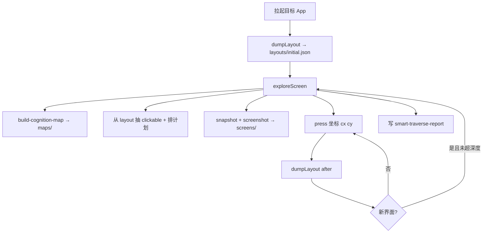

# traverse-output 报告生成全流程

`traverse-output/` 下的 `*-smart-v3/`、`hongguo-smart/` 等目录，主要由 **认知驱动智能遍历** 生成，入口为 `scripts/run-smart-traverse-app.sh`。

---

## 1. 目录结构（以 `xhs-smart-v3` 为例）

```text
xhs-smart-v3/
├── smart-traverse-report.md    # 人类可读总报告 ★
├── smart-traverse-report.json  # 机器可读（plan、每次 click）
├── layouts/                    # 每次 dumpLayout 的完整 JSON
│   ├── initial.json
│   ├── s1_d0_after_0.json
│   └── recover_probe_*.json
├── maps/<screenId>/            # 每屏认知地图
│   ├── cognition-map.json
│   └── cognition-map.md
└── screens/<screenId>/         # 截图 + agent-device snapshot
    ├── s1_d0.png
    └── s1_d0.json
```

根目录其它文件：

| 文件 | 来源 |
|------|------|
| `cognition-map.*` | 单次 `build-cognition-map.js` |
| `app-map.json` / `app-map.md` | `merge-app-map.js` 合并多屏 |
| `app-map-example.md` | 多屏合并示例（文档） |

---

## 2. 一键执行

```bash
pnpm build

export TRAVERSE_DEVICE=<agent-device --device 名>
export TRAVERSE_HDC_TARGET=<hdc -t 设备ID>

./scripts/run-smart-traverse-app.sh \
  <包名> \
  EntryAbility \
  ./traverse-output/<输出目录> \
  <session名>
```

脚本内部：`uitest 预检` →（可选）`bm clean` → `open` → `smart-traverse-from-cognition.mjs` → `close`。

Ability 参数可省略，脚本会从 `apps --json` 的 `launchAbility` 自动解析。

### 可选环境变量

| 变量 | 默认 | 含义 |
|------|------|------|
| `TRAVERSE_MAX_DEPTH` | `2` | 界面递归深度（与 UI 树 `treeDepth` 无关，见 [07](./07-深度概念与遍历调参.md)） |
| `TRAVERSE_MAX_TARGETS` | `12` | 每屏最多点击数 |
| `TRAVERSE_RUN_UNTIL_SEC` | 空 | 多轮循环时长上限（秒） |
| `TRAVERSE_CLEAR_APP_STORAGE` | `1` | 遍历前 `bm clean`；`0` 跳过 |
| `TRAVERSE_OPEN_MODULE` | 空 | `open --module` |
| `TRAVERSE_DEVICE` | hdc 首设备 | agent-device 设备名 |

**已知问题**（滴滴等首启 App）：脚本用 `press` 坐标 + modal 单点退出，易「点一次就停」。改法见 [12-遍历脚本已知问题与改法](./12-遍历脚本已知问题与改法.md)；验证用 [11-实操案例-滴滴首启与CLI探索](./11-实操案例-滴滴首启与CLI探索.md)。

---

## 3. 核心脚本在做什么



### 3.1 与 `snapshot -i` 的区别

| | 智能遍历 | 手动 `snapshot -i` |
|--|----------|-------------------|
| UI | **完整** `dumpLayout` JSON | 过滤后的 nodes |
| 点击 | **坐标** `(cx, cy)` via `press` | `@eN` / `label="…"` via **`click`** |
| 规划 | `build-cognition-map` + 规则排序 | 人工或模型读 `-i` |

**重要**：首启/系统弹窗验证应优先 CLI `click`，再反推脚本；滴滴对比见 [附录-终端实录-滴滴脚本vsCLI对比](./附录-终端实录-滴滴脚本vsCLI对比.md)。

### 3.2 安全护栏（脚本内置）

- 隐私/系统弹窗：只点「同意/确定/知道了」类；**不点**「不同意/拒绝」  
- 点击前后检查目标 `bundleName`，偏离则 `open` / `aa start` 恢复  
- 桌面 `sceneboard`、错包名 → 停止或 recover（`recover_probe_*.json`）  

### 3.3 报告怎么读（`smart-traverse-report.md`）

- **遍历界面数**：不同 fingerprint 的屏数  
- **总点击 / 跳过**：护栏或 wrong_app 导致跳过  
- **新界面**：点击后 layout 明显变化且未访问过  
- 每屏：**计划点击** + **执行结果**（新界面 / 无变化 / 跳过）  

示例：`traverse-output/xhs-smart-v3/smart-traverse-report.md`。

---

## 4. 其它生成方式（不产出 smart-traverse-report）

| 命令 | 产出 |
|------|------|
| `node scripts/build-cognition-map.js <layout.json> <dir>` | 单屏 `cognition-map.*` |
| `node scripts/merge-app-map.js a.json b.json out.json` | `app-map.json` + `.md` |
| `scripts/harmonyos-traverse.sh` | 简单 snapshot 遍历 + summary |

说明：`smart-traverse-workflow.md` 中的 `merge-cognition-maps.js` 在仓库里实际为 **`merge-app-map.js`**。

**ONNX 与遍历分离**：`smart-traverse-from-cognition.mjs` **不**集成 block/widget ONNX。DevEco 逆向全过程与结论见 [08-DevEco探索测试逆向与结论.md](./08-DevEco探索测试逆向与结论.md)。

---

## 5. 与手动 CLI 如何配合

1. **批量探索、要报告** → `run-smart-traverse-app.sh`（改完脚本前对首启 App 慎用）  
2. **弹窗内精细点按、断言** → `open` + `snapshot -i` + **`click`** / `press label=…`（见 [05](./05-实操案例-登录与弹窗.md)、[11](./11-实操案例-滴滴首启与CLI探索.md)）  
3. **系统 overlay** → `snapshot` 全树，勿只靠 `-i`  
4. **静态规划单屏** → `dumpLayout` + `build-cognition-map.js`  
5. **加深遍历、按 App 调参** → [07-深度概念与遍历调参](./07-深度概念与遍历调参.md)  
6. **脚本改法 backlog** → [12-遍历脚本已知问题与改法](./12-遍历脚本已知问题与改法.md)
