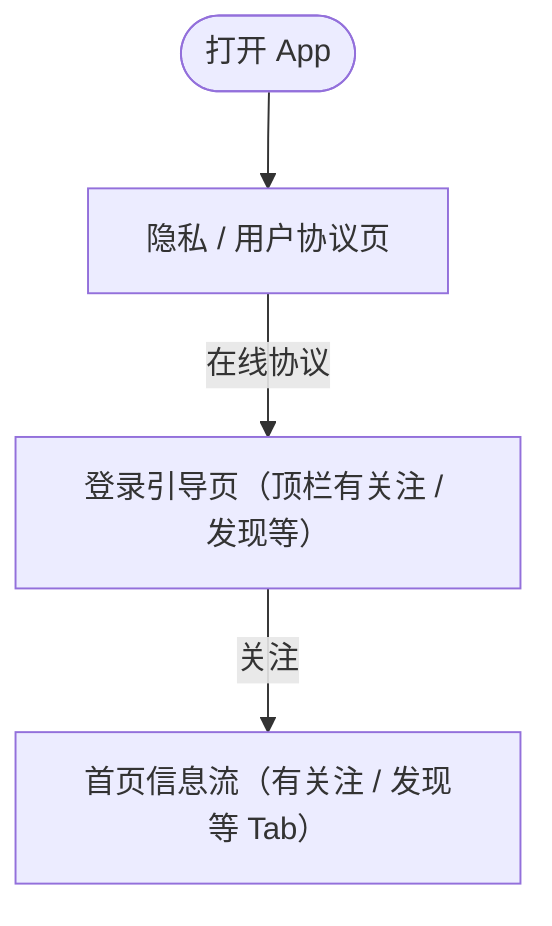

# 遍历怎么走（可读版）

## 这份报告在说什么？

自动遍历脚本会像人一样：**在当前界面挑几个可点项 → 点一下 → 看有没有换屏 → 换屏了就继续往里逛**。本文件把这件事用**中文步骤**说清楚；技术细节见文末。

## 一句话总结

从「隐私 / 用户协议页」出发，沿主路径依次点：「在线协议」 → 「关注」，一共深入 **3** 个不同界面。

## 主路径（只看「真的换了一屏」的线）

```
【隐私 / 用户协议页】
    │
    │  点击「在线协议」
    ▼
【登录引导页（顶栏有关注 / 发现等）】
    │
    │  点击「关注」
    ▼
【首页信息流（有关注 / 发现等 Tab）】
    │
    └─ 在本屏还试了：「关注」、「发现」（有变化，但未继续往下逛）
```

## 逐步回放（推荐先看这里）

### 第 1 屏：隐私 / 用户协议页

- **内部编号：** `s1_d0`（仅方便对照截图/JSON，可忽略）
- **怎么到这屏：** 打开 App 后的**首屏**
- **界面规模：** 约 102 个 UI 元素

| 点了什么 | 结果 |
| -------- | ---- |
| 《小红书用户服务协议》 | ⚪ **还在本屏**（元素数量几乎没变） |
| 在线协议 | ✅ **进入下一屏**（脚本记为 `s2_d1`） |
| English Version | ⛔ 点击后前台变成其他应用，安全护栏中止 |

### 第 2 屏：登录引导页（顶栏有关注 / 发现等）

- **内部编号：** `s2_d1`（仅方便对照截图/JSON，可忽略）
- **怎么到这屏：** 在「隐私 / 用户协议页」里点击了 **「在线协议」** 才来到本屏
- **界面规模：** 约 323 个 UI 元素

| 点了什么 | 结果 |
| -------- | ---- |
| 关注 | ✅ **进入下一屏**（脚本记为 `s3_d2`） |
| 发现 | ⛔ 点击后前台变成其他应用，安全护栏中止 |

### 第 3 屏：首页信息流（有关注 / 发现等 Tab）

- **内部编号：** `s3_d2`（仅方便对照截图/JSON，可忽略）
- **怎么到这屏：** 在「登录引导页（顶栏有关注 / 发现等）」里点击了 **「关注」** 才来到本屏
- **界面规模：** 约 283 个 UI 元素

| 点了什么 | 结果 |
| -------- | ---- |
| 关注 | 🟡 **内容有变化**，但脚本**没有继续往下逛**（当时 `maxDepth=2` 已到顶，只记了一次点击） |
| 发现 | 🟡 **内容有变化**，但脚本**没有继续往下逛**（当时 `maxDepth=2` 已到顶，只记了一次点击） |
| 附近 | ⛔ 点击后前台变成其他应用，安全护栏中止 |

## 结果符号说明

| 符号 | 含义 |
| ---- | ---- |
| ✅ | 进入报告里登记的**下一屏**，脚本继续递归 |
| 🟡 | 点击后 layout 变了，但**没有继续往下逛**（常见原因：`maxDepth` 已到） |
| ⚪ | 点了，但**仍停在本屏** |
| ⛔ | **没走完点击**（误开其他 App、回桌面等，安全护栏拦截） |

## 名词说明（看不懂编号时看这里）

- **`s1_d0` / `s2_d1` 等**：内部屏幕编号，不是业务名；`s` = 第几个登记的屏，`d` = 遍历深度。
- **`nodes=102`**：这一屏 UI 树里大约有多少个节点，只表示复杂度，不是业务字段。
- **`maxDepth`**：最多往里逛几层；本次为 **2**，所以最深只登记到 depth=2 的屏。

## 流程图（Mermaid）

用 VS Code / Cursor 预览 `smart-traverse-tree.mmd`，或把下面代码贴到 [Mermaid Live](https://mermaid.live)。



---

## 附录：技术向决策树

<details>
<summary>展开查看（含 screenId、nodes、layoutPattern）</summary>

- **s1_d0 · depth=0 · nodes=102 · navigation-based**
  - · `《小红书用户服务协议》` — 无变化 (102→102)
  - → `在线协议` — 新界面 (102→323) → **s2_d1**
  - ⊘ `English Version` — 跳过 (wrong_app)
  - **s2_d1 · depth=1 · nodes=323 · navigation-based, tab-based, vertical-scroll, horizontal-layout, list-view**
    - → `关注` — 新界面 (323→283) → **s3_d2**
    - ⊘ `发现` — 跳过 (wrong_app)
    - **s3_d2 · depth=2 · nodes=283 · navigation-based, tab-based, vertical-scroll, horizontal-layout, list-view**
      - → `关注` — 新界面 (283→271) · 未子遍历
      - → `发现` — 新界面 (283→269) · 未子遍历
      - ⊘ `附近` — 跳过 (wrong_app)

</details>

生成时间: 2026-05-27T09:29:39.743Z · 来源 `smart-traverse-report.json` · 包名 `com.xingin.xhs_hos`